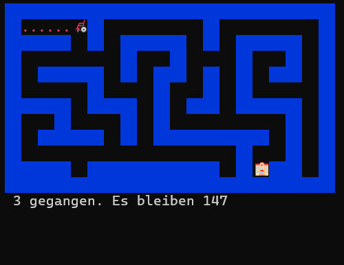
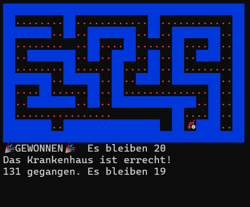

# C# Labyrinth Escape: Automated Pathfinding

Eine interaktive, performante C#-Konsolenanwendung, die automatische Wegfindung (Pathfinding) in einem 2D-Labyrinth demonstriert. Der Fokus lag auf algorithmischer Logik (Backtracking), der effizienten Manipulation von 2D-Arrays und einem sauberen Konsolen-Rendering mit UTF-8-Zeichen und Emojis.

 
   
   

## Tech Stack

Dieses Projekt wurde als reine Backend-/Konsolen-Logik ohne externe Frameworks umgesetzt:

* **Sprache:** C#
* **Plattform:** .NET Core / .NET 8 
* **Konzepte:** 2D-Arrays, Listen (Generics), Konsolen-Puffer-Manipulation, Threading (Sleep)

## Features

* **Automatisches Pathfinding:** Implementierung eines Backtracking-Algorithmus (ähnlich einer simplen Tiefensuche / Depth-First Search), der selbstständig den Weg zum Ziel sucht und aus Sackgassen umkehrt.
* **Visuelles Feedback:** Intuitive Darstellung durch UTF-8 Emojis und farbliche Markierungen für Wände und bereits gegangene Wege.
* **Ressourcen-Management:** Ein integrierter Schrittzähler mit Limit (150 Schritte).
* **Historien-Tracking:** Dynamische Speicherung der Koordinatenverläufe, um bei einer Sackgasse zum letzten gültigen Punkt zurückkehren zu können.

